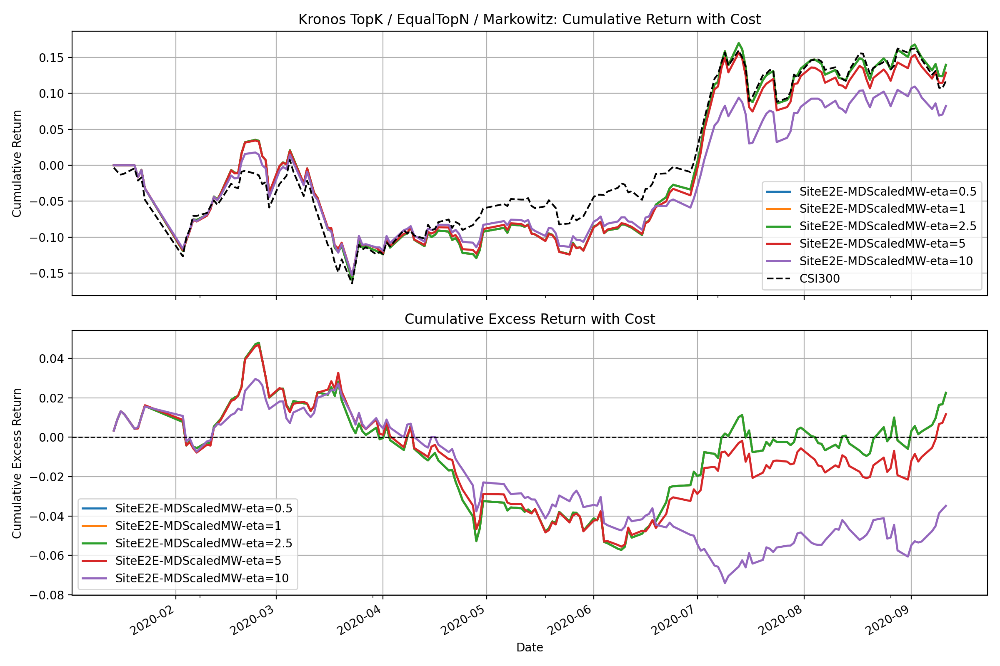

# Method 1 Mean-Downside Core + Scaled Markowitz

本实验保留旧版最强信号 `mean_downside_ret` 的按天全市场 z-score 构造，训练阶段只微调核心信号的缩放与小残差；最终回测阶段复用 `qlib_markowitz_test.py` 中的 scaled Markowitz 逻辑，即 `mu_scale` 与 L1 换手惩罚。

## 数据切分

- `train_data.pkl`: 2011-05-20 至 2018-12-14，共 1811 个信号日
- `val_data.pkl`: 2019-01-16 至 2019-12-17，共 222 个信号日
- `test_data.pkl`: 2020-01-14 至 2020-09-11，共 162 个信号日

## 训练后的参数

| eta       | best_epoch | best_val_loss | core_scale | residual_mean | residual_last | residual_max | residual_downside | residual_volatility | effective_mean | effective_last | effective_max | effective_downside_signed | effective_volatility_signed |
| --------- | ---------- | ------------- | ---------- | ------------- | ------------- | ------------ | ----------------- | ------------------- | -------------- | -------------- | ------------- | ------------------------- | --------------------------- |
| 0.500000  | 3.000000   | -0.005500     | 1.011512   | 0.015169      | 0.003404      | 0.008482     | -0.005944         | 0.000260            | 1.014546       | 0.000681       | 0.001696      | -0.304642                 | 0.000052                    |
| 1.000000  | 3.000000   | -0.005465     | 1.011003   | 0.014315      | 0.003639      | 0.008367     | -0.005993         | 0.000703            | 1.013866       | 0.000728       | 0.001673      | -0.304499                 | 0.000141                    |
| 2.500000  | 3.000000   | -0.005342     | 1.010634   | 0.013507      | 0.002977      | 0.007404     | -0.006326         | 0.000044            | 1.013335       | 0.000595       | 0.001481      | -0.304455                 | 0.000009                    |
| 5.000000  | 4.000000   | -0.005133     | 1.011927   | 0.012711      | 0.001625      | 0.006122     | -0.009866         | -0.002463           | 1.014469       | 0.000325       | 0.001224      | -0.305551                 | -0.000493                   |
| 10.000000 | 4.000000   | -0.004728     | 1.010664   | 0.010373      | -0.000768     | 0.002184     | -0.011019         | -0.006207           | 1.012738       | -0.000154      | 0.000437      | -0.305403                 | -0.001241                   |

## Qlib 测试集回测结果

| strategy                   | annualized_excess_return | information_ratio | max_drawdown |
| -------------------------- | ------------------------ | ----------------- | ------------ |
| SiteE2E-MDScaledMW-eta=0.5 | 0.033082                 | 0.383432          | -0.105156    |
| SiteE2E-MDScaledMW-eta=1   | 0.033085                 | 0.383465          | -0.105154    |
| SiteE2E-MDScaledMW-eta=2.5 | 0.033099                 | 0.383619          | -0.105154    |
| SiteE2E-MDScaledMW-eta=5   | 0.017135                 | 0.201473          | -0.102349    |
| SiteE2E-MDScaledMW-eta=10  | -0.051165                | -0.723386         | -0.103599    |

## 结果图

## 参数

- core_signal: `cs_zscore(mean) - 0.3 * cs_zscore(downside)`
- residual_scale: 0.2
- core_scale_range: +/-0.5
- etas: (0.5, 1.0, 2.5, 5.0, 10.0)
- top_n: 50
- cov_lookback: 60
- rebalance_freq: 5
- turnover_penalty: 0.02
- max_weight: 0.04
- mu_scale: 0.003
- epochs: 30
- qp_steps: 5
- projection_steps: 8
